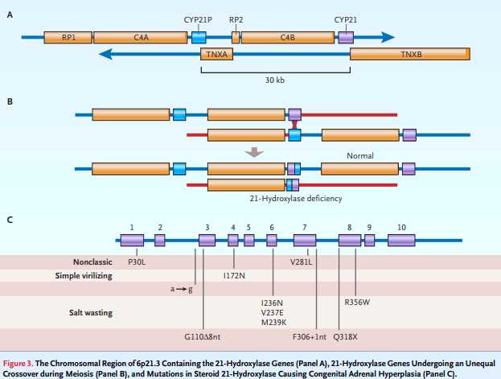

# Congenital Adrenal Hyperplasia

## Introduction
* a deficient cortisol synthesis
* adrenal insufficiency by dysfunction of 
    + **adrenal gland** (primary) 
    + **pituitary gland** (secondary)
* Cortisol is the major glucocorticoid and exerts a negative feedback on CRH and ACTH release, thereby inhibiting the HPA axis
* prevalence
    + 1:15,000-16,000 in Europe and the USA and 1:19,000 in Japan [[2004_vanderKamp]](https://doi.org/10.1530/eje.0.151u071)
* more than 90% - 21-hydroxylase deficiency [[2003_Speiser]](https://doi.org/10.1210/jc.2018-01865)
    + chromosome 6p21.3
    + mutation in CYP21

* Classification 
    + Classic
        - salt wasters (75%):  a deficiency also in the aldosterone synthesis [[2000_White]](https://doi.org/10.1210/edrv.21.3.0398)
        - simple virilisers: elevated concentrations of androgens [[2003_Speiser]](https://doi.org/10.1210/jc.2018-01865)
    + Non-classic: slightly elevated androgen concentrations

* Genetic background 

*Figure from [2003_Speiser](https://doi.org/10.1210/jc.2018-01865).*

---

