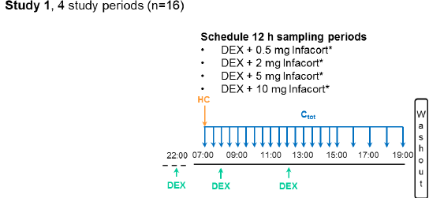
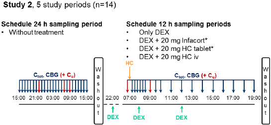
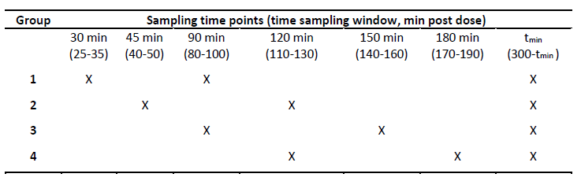

# Clinical Trials
## Reported by 2015_Whitaker 
* [[2015_Whitaker]](https://doi.org/10.1210/jc.2014-4060)
    * EudraCT number: 2013-000260-28
    * NCT02777268
    * Phase 1 Trial
    * Healthy male volunteers
        * 18-60 years
        * no clinically significant sensitivity to hydrocortisone
        * no clinically significant sensitivity to dexamethasone (DEX)  
        * no infection
    * performed at Simbec Research Ltd (Merthyr Tydfil, UK)
* Formulation: Infacort® (Diurnal Ltd)
* administration of HC (08:00 and 13:00)
    * after which received standardised meals
* <u>four study periods</u>
    * n=16
        * 2 volunteers were excluded 
            * insufficient suppression of the HPA axis
        * median values with range
            * $age$ 43.5 (21.0-59.0) years
            * $body weight$ 81.6 (64.7-96.0) kg
            * $height$ 1.77 (1.64-1.95) m
    * DEX
        * 1 mg 
        * in each study period
        * to suppress the endogenous cortisol synthesis
    * Single morning oral (po) doses of Infacort
        * 0.5 mg 
        * 2   mg
        * 5   mg
        * 10  mg 
    * Washout period 
        * at least 1 week between periods
    * Measurements
        * Total plasma cortisol concentrations ($C_{tot}$)
            * every 0.5 h between [0 h, 8 h] 
            * every 1.0 h between [9 h, 12 h]
            * LC-MS/MS
              * Applied Biosystems MDS Sciex API 365 triple quadrupole atmospheric pressure ionisation mass spectrometer
            * LLOQ 1.38 nmol/L

*Summary of study design of the clinical trial. Figure was adopted from [PhD thesis of Johanna Melin](https://refubium.fu-berlin.de/handle/fub188/23620).*

---

## Reported by 2016_Debono 
* [[2016_Debono]](https://doi.org/10.1210/jc.2015-3694)
    * EudraCT number: 2013-000259-42
    * NCT01960530
    * Phase 1 Trial
    * included evaluation of the endogenous cortisol synthesis/concentrations in absence of DEX
    * healthy male volunteers 
        * (18-60 years)
        * no clinically significant sensitivity to hydrocortisone
        * no clinically significant sensitivity to dexamethasone (DEX)  
        * no infection
    * performed at Simbec Research Ltd (Merthyr Tydfil, UK)
* Formulation
    * Infacort® (Diurnal Ltd)
    * HC tablet (Auden Mackenzie Ltd)
    * hydrocortisone succinate (iv)
* Administration of HC (08:00 and 13:00)
    * after which received standardised meals
* <u>five study periods</u>
    * n=14
        * no signs of insufficient suppression of the HPA axis
        * median values with range
            * $age$ 28.5 (22.0-60.0) years
            * $body weight $ 82.9 (63.6-102.7) kg
            * $height$ 1.83 (1.68-1.96) m
    * 1 period without + 4 with DEX 
    * single morning oral (po) or iv doses
        * 20  mg 
    * DEX
        * 1 mg 
        * in each study period
        * to suppress the endogenous cortisol synthesis
    * washout period 
        * at least 1 week between last 4 periods
    * Measurements
        * Total plasma cortisol concentrations ($C_{tot}$)
            * every 1.00 h between [0 h, 24 h] in absence of DEX (15:00-15:00)
            * every 0.25 h between [0 h, 3 h] 
            * every 1.00 h between [4 h, 6 h]
            * every 2.00 h between [6 h, 12 h]
            * LC-MS/MS
                * Applied Biosystems MDS Sciex API 365 triple quadrupole atmospheric pressure ionisation mass spectrometer
                * LLOQ of 1.38 nmol/L
                * intra-assay variability 9.6% between [4.14 and 553] nmol/L
                * inter-assay variability 3.7% between [4.14 and 553] nmol/L
                * Accuracy <5% between [0.5, 300] nmol/L
        * CBG [[2003_Lewis]](https://doi.org/10.1016/s0009-8981(02)00417-5)
            * ELISA (Biovendor, Czech republic, Brno)
                * LLOQ of 3.13 ng/mL
                * intra-assay variability < 3.0%
                * inter-assay variability < 8.0%
        * unbound cortisol concentrations ($C_u$)
            * 22:00 in absence of DEX
            * 07:00 in absence of DEX
            * 09:00 in absence of DEX
            * pre dose
            * 2.0 h post dose
            * LC/MS-MS
                * LLOQ of 0.80 nmol/L
                * intra-assay variability <8.0%
                * inter-assay variability <9.5%
                * Accuracy <10.4% for concentrations between [2.7, 72.0] nmol/L [[2012_Jones]](https://doi.org/10.1016/j.jchromb.2011.11.036)

*Summey of study design of the clinical trial. Figure was adopted from [PhD thesis of Johanna Melin](https://refubium.fu-berlin.de/handle/fub188/23620).*

---

## Reported by Charite 
* [[2016_Debono]](https://doi.org/10.1210/jc.2015-3694)
    * EudraCT number: 2014-002265-30 
    * Phase 3 Trial
    * Institute of Experimental Paediatric Endocrinology at Charite-Universitätsmedizin Berlin
* Population Summary

| Cohort       | Age Range         | Sample Size | Description                       |
|--------------|-------------------|-------------|-----------------------------------|
| Cohort 1     | 2-6 years         | n=12        | young children                    |
| Cohort 2     | 28 days-2 years   | n=6         | infants                           |
| Cohort 3     | birth-28 days     | n=6         | neonates                          |

* Dose: 1-4 mg
    * fasted 2h before and 1h (or 30 min for <1 y.o.) after dose 
* Formulation: opened Infacort capsule
    * granules
    * with a spoon onto the tongue of the child 
    * washed down with fluid (milk, juice, water).
* Measurements from intravenous cannula
    * Total plasma cortisol concentrations ($C_{tot}$)
        * performed at Simbec Research Ltd (Merthyr Tydfil, UK)
    * CBG
        * performed at Simbec Research Ltd (Merthyr Tydfil, UK)
    * albumin

*Study design of the clinical trial. Figure was adopted from [PhD thesis of Johanna Melin](https://refubium.fu-berlin.de/handle/fub188/23620).*

---

## Studies by Charmandari  
* [[2001b_Charmandari]](https://doi.org/10.1210/jcem.86.10.7972)
* [[2001c_Charmandari]](https://doi.org/10.1677/joe.0.1690065)
* n=42
* classical 21-hydroxylase deficiency
* age: 7-17 years
* adequate HPA axis suppression
    * ACTH concentrations at 08:00 <71 pg/mL 
    * 17-OHP concentrations <20 nmol/L
* Exclusion criteria: 
    * inadequate HPA axis suppression
        * ACTH concentrations at 08:00 <71 pg/mL 
        * 17-OHP concentrations <20 nmol/L
    * Patients with signs of precocious puberty
    * other signs of endocrine disorder
    * insufficient dosing history
* Standard treatment of fludrocortisone
* Morning dose
    * median 123.8 μg/$m^2$
    * range 54.0-160.0
* po administration
    * Hydrocortone, Merck Sharp & Dohme Ltd
    * n=17
        * 08:00
        * 15:00  
        * 22:00
    * n=13
        * 09:00  
        * 21:00
* single iv bolus administration
    * Solu-Cortef, Pharmacia & Upjohn
    * n=16
    * 15 mg/$m^2$
* Measurements 
    * Total plasma cortisol concentrations ($C_{tot}$) [[2001b_Charmandari]](https://doi.org/10.1210/jcem.86.10.7972)
        * {iv} every 10 min up to 6 h post dose
        * {po} every 20 min up to 24 h
        * solid phase radioimmune assay
            * Coat-A-Count, DPC, Los Angeles, CA, USA.
            * LLOQ of 21-28 nmol/L
            * inter-assay variability 
                * 6.3% for 138 nmol
                * 4.5% for 276 nmol
  * [17-OHP] [[2001c_Charmandari]](https://doi.org/10.1677/joe.0.1690065)
      * {po} every 20 min up to 24 h
      * solid phase radioimmune assay
          * Coat-A-Count, DPC, Los Angeles, CA, USA
          * LLOQ of 0.3 nmol/L
          * inter-assay variability 
              * 11% for 1.06 nmol
              * 8.5% for 18.5 nmol

---

